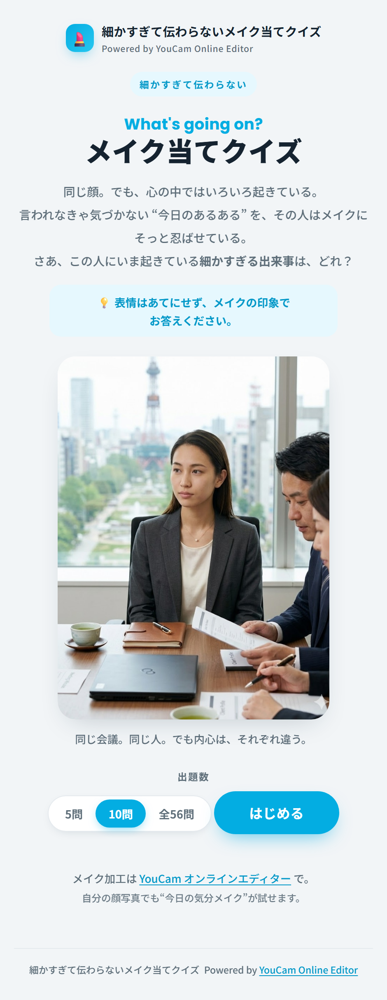
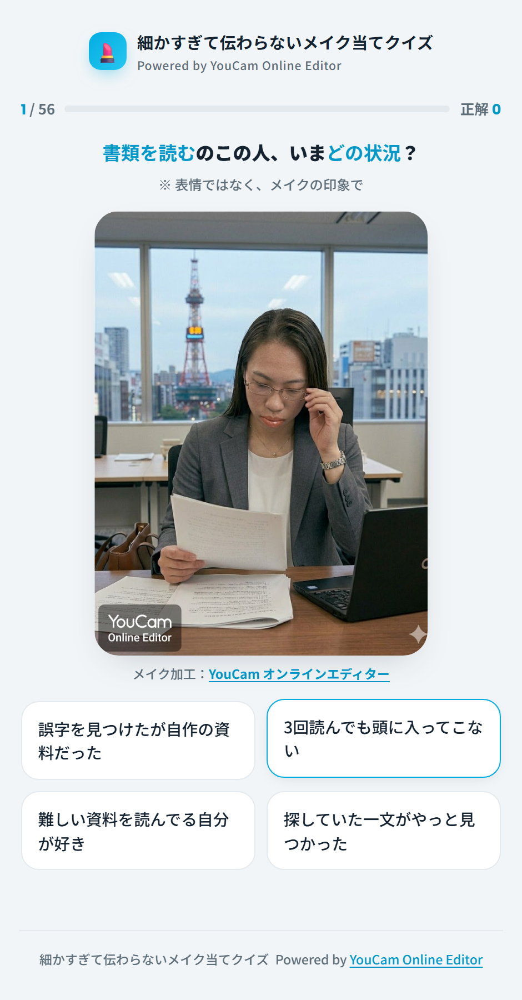
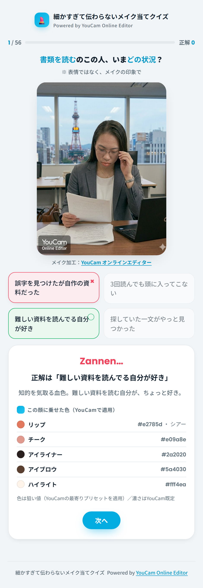
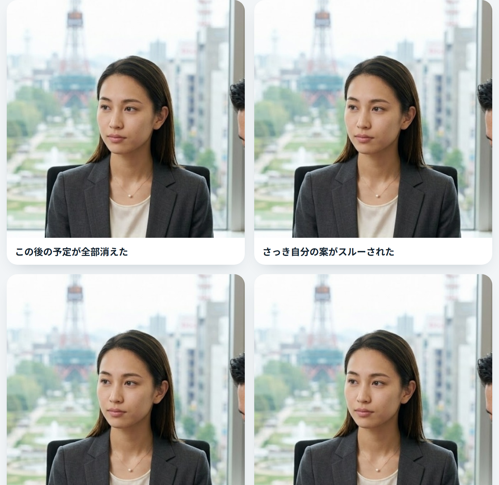
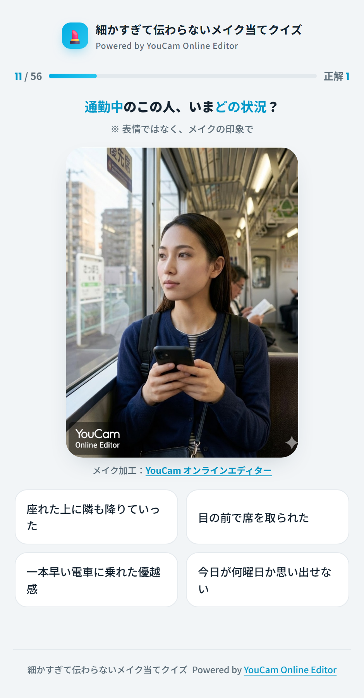

> ZennFes Spring 2026 の参加作品です。メイク加工は [YouCam オンラインエディター](https://yce.perfectcorp.com/ja?affiliate=zennfes_spring_2026) を使っています（画像に入っている透かしも YouCam のものです）。

## きっかけ

会議中に同僚の横顔を見て、「この人、今日ちょっと帰りたそうだな」と勝手に思うことがあります。あとで聞くと全然違う理由だったりもする。

その「言われないと分からないけれど、本人の中では切実」な気分を、メイクに仕込んだら他人に当てられるのか。そこから始めました。たとえば、会議中のこの顔。

> 微熱があるので場合によっては帰りたい

血色をひとつ抜いて、チークは置かない。リップはくすませて、でも眉とアイラインは残す（まだ帰ると決めたわけではないので）。……まあ、伝わらないと思います。そこが面白いだろう、という遊びです。

## 作ったもの

遊べます → https://subara3.github.io/youcam-makeup-quiz/



会議中・通勤中・飲み会中といった同じ人の同じシーン写真に、4通りの「今日の気分」をメイクの差分で乗せています。プレイヤーは顔を見て、4つの細かい状況から正解を選びます。



選択肢は喜怒哀楽がばらけるように選んであるので、全部しんどい系で見分けがつかない、みたいな理不尽は起きません。とはいえ、メイクの違いは細かすぎてほとんど伝わりませんが。

答えると、その顔に乗せた色を種明かしします。「リップ、この色だったのか」くらいの軽い答え合わせです。



## 同じシーンに、違う差分



同じ会議室、同じ人。違うのは今日の気分だけ。それをリップの色温度、チークの有無、眉の強さで描き分けています。感情ごとの方針はだいたいこんな感じです（細かい値は `PARAMS.md` に置いてあります）。

- はしゃぎ：ピンクのグロス、血色とハイライト多め
- いらだち：深い赤のマット、眉とアイラインを締める
- しょんぼり：くすんだリップ、チークは置かない
- ごきげん：コーラルのシアー、自然な血色

## 量産は Playwright で

14シーン × 4気分で56枚。手作業はつらいので、YouCam オンラインエディターを Playwright で動かしました。やっていることは二つです。

ひとつめ。エディタのカラーパレットは各色玉が `background-color` を持っているので、それを読んで、狙った色にいちばん近い玉をクリックします。

```js
const balls = [...document.querySelectorAll('[class*="color-ball_singleColor"]')];
let best, min = Infinity;
for (const el of balls) {
  const [r, g, b] = getComputedStyle(el).backgroundColor.match(/\d+/g).map(Number);
  const d = (r - tr) ** 2 + (g - tg) ** 2 + (b - tb) ** 2; // 狙った色との距離
  if (d < min) { min = d; best = el; }
}
best.click();
```

ふたつめ。バーチャルメイクは透かしなしのダウンロードが有料なので、ダウンロードは使わず、編集中のプレビュー画面をそのままキャプチャしました。透かしは YouCam のものが残りますが、出どころが分かるのでこの用途では困りませんでした。

ブラウザは開いたまま、写真だけ差し替えて56回。途中でタブが落ちたら作り直す、くらいの雑な作りですが、最後まで通りました。

### 正直なところ：濃さは調整できなかった

最初は色も濃さも数値で指定するつもりでした。が、Web版のエディタには濃さのスライダーがありません。調整できるのは色と質感だけです。なので濃さは YouCam の既定のまま、感情の差は「色」と「どのパーツを使うか」で出しています。

濃さまで数値で指定したい場合は、makeup-vto API（`colorIntensity` を 0〜100 で渡せる）を使う必要があります。同じ設定を API のリクエストに変換するスクリプトも置いてありますが、こちらはユニットが有料です。

## 結果画面



正答率でひとことコメントが変わります。「雰囲気で生きている」あたりが、たぶん一番リアルです。

## おわりに

バーチャルメイクは用意されたメイクから選ぶもの、という認識でしたが、色や質感をコードで指定できるので「気分を色で塗る」みたいな使い方もできました。

自分の顔写真でも同じことができます。気が向いたら [YouCam オンラインエディター](https://yce.perfectcorp.com/ja?affiliate=zennfes_spring_2026) で、今日の自分の気分も塗ってみてください。たぶん、誰にも伝わりませんが。

---

*ZennFes Spring 2026 / Powered by [YouCam Online Editor](https://yce.perfectcorp.com/ja?affiliate=zennfes_spring_2026)*
*※ スクショは `screenshots/`。Zenn へは画像を別途アップロードしてパスを差し替えてください。*
